# YALA (Yet Another LuCI App)

<div align="center">
  
  <h2>Modern OpenWrt & LuCI Router Manager for Mobile</h2>
  <p>Maintained by <b>@nightcodex7</b></p>

  [](https://play.google.com/store/apps/details?id=com.nightcode.luci&referrer=utm_source%3Dgithub%26utm_medium%3Dreadme%26utm_campaign%3Drepo_header)
  [](https://github.com/nightcodex7/yala/releases)
  [](https://github.com/nightcodex7/yala/releases)
  [](https://github.com/nightcodex7/yala)
  [](https://flutter.dev)
  [](https://dart.dev)
  [](LICENSE)
  []()
  [](https://openwrt.org)

  <br>

  <a href="https://play.google.com/store/apps/details?id=com.nightcode.luci&referrer=utm_source%3Dgithub%26utm_medium%3Dreadme%26utm_campaign%3Dplay_badge">
    
  </a>

  <br><br>

  <h3>Dashboard Preview (Light & Dark Theme)</h3>
  <p>
    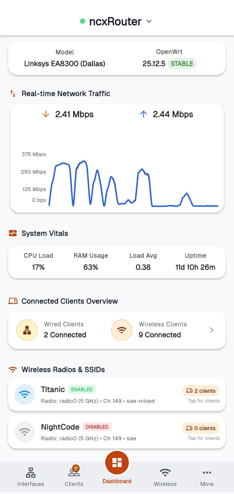
    &nbsp;&nbsp;&nbsp;&nbsp;
    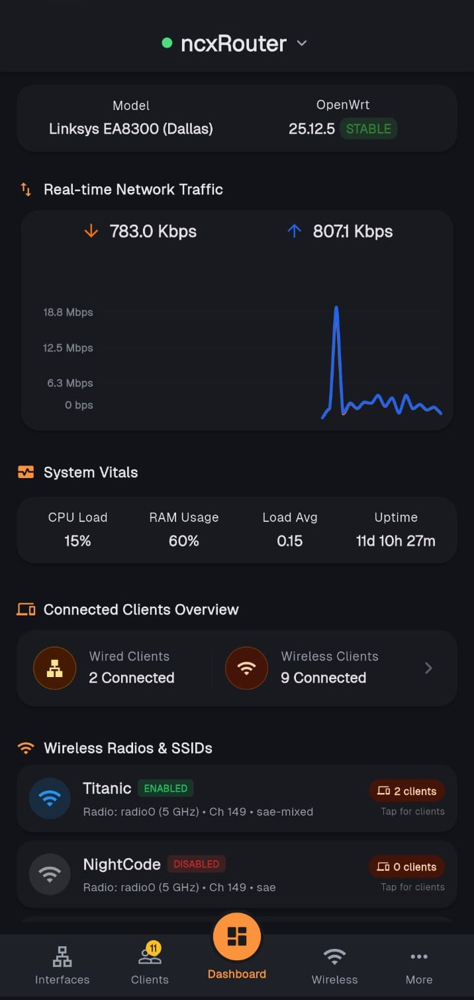
  </p>
</div>

<br>

**YALA (Yet Another LuCI App)** is an open-source mobile client for managing OpenWrt routers. It communicates with OpenWrt's LuCI JSON-RPC backend to provide intuitive network management, real-time metrics, wireless configuration, firewall rules, package management, system backups, and client controls directly from your phone.

---

## Key Features

### Multi-Router Management & Secure Vault

- **Multi-Device Support:** Manage and switch between multiple OpenWrt routers with isolated credentials stored in native secure storage.
- **Resilient Authentication Stack:** Automatic fallback chain supporting LuCI RPC (`/cgi-bin/luci/rpc/auth`), ubus JSON-RPC (`session.login`), and redirect-aware CGI form authentication (`sysauth` cookies and `stok` tokens).
- **HTTPS & Custom Ports:** Connect via HTTP or HTTPS with custom port configurations and local SSL certificate validation overrides.

### Parental Controls & Scheduled Access

- **Profile-Based Management:** Group connected devices under profiles with customizable access schedules.
- **Automated Access Windows:** Enforces firewall blocking rules during scheduled restriction windows and restores access automatically when windows expire.
- **Domain Filtering & Overrides:** Filter specific domains per profile or toggle instant unrestricted bypass overrides.

### Guest Wi-Fi & Wireless Diagnostics

- **One-Click Guest Networks:** Provision guest Wi-Fi SSIDs with automatic AP client isolation (`ap_isolate=1`) and dedicated firewall zone isolation.
- **Wi-Fi Access Control:** Enforce MAC address allowlists or denylists with direct router UCI synchronization.
- **QR Code Sharing:** Generate on-screen Wi-Fi QR codes for quick client connection.
- **Multi-Band Diagnostics:** Monitor 2.4GHz, 5GHz, and 6GHz radios with frequency details, channel width, transmit power, and connected station bandwidth metrics.

### Self-Device Protection & Atomic UCI Engine

- **Self-Device Guard:** Automatically detects local client IP and MAC addresses to prevent accidental self-lockouts during access rule changes.
- **Atomic UCI Rollback:** Automatically executes `uci revert` across target configuration files if an intermediate multi-step RPC request fails.

### Dashboard & Network Vitals

- **Dual Themes:** Switch seamlessly between Light and Dark Material 3 themes.
- **Animated Gauges:** Live visual gauges for CPU load, RAM usage, Swap space, and root `/` filesystem capacity.
- **Real-Time Throughput Graph:** Smooth live chart displaying network transfer rates (Rx/Tx) with customizable polling intervals.
- **Interface Cards:** Status cards for WAN, LAN, and WWAN showing IP addresses, MACs, protocols, and WAN public IP verification.

### Connected Client Management

- **Unified Client List:** Aggregates active DHCP leases, ARP neighbor entries, and wireless stations into a single view.
- **Device Details:** Displays hostname, IP, MAC address, vendor OUI, connected SSID, and radio band badges.
- **IPv6 Management:** Displays deduplicated IPv6 address lists with toggleable expand/collapse views for multiple private or link-local addresses.
- **Static Leases:** View, add, and modify static DHCP IP assignments.

### OPKG & APK Dual Package Manager

- **Smart Engine Detection:** Automatically switches between standard `opkg` (OpenWrt 21.02–23.05) and modern `apk` (OpenWrt 24.10+) package engines.
- **Package Management:** Search repository feeds, update package lists, install, and remove packages.
- **LuCI App Finder:** Discover and manage installed vs. available LuCI extension modules (`luci-app-*`).

### System Services, VPN & Storage

- **Services Control:** View active `procd` daemons and init scripts; start, stop, restart, enable, or disable services remotely.
- **VPN Monitoring:** Monitor status and interfaces for WireGuard, OpenVPN, Tailscale, and ZeroTier connections.
- **Cron Scheduler:** View and edit system scheduled tasks (`/etc/crontabs/root`).
- **Disk & Storage Monitor:** Monitor disk space breakdown for root `/`, `/overlay`, `/tmp`, and attached USB drives.

### Backup, Restore & Partition Tools

- **Pre-Restore Validation:** Validates gzip headers (`0x1F 0x8B`) and `ustar` archive structures prior to upload to prevent corrupt backup restores.
- **Preserved File Viewer:** Inspect files marked for retention during sysupgrade operations (`sysupgrade -l`).
- **MTD Partition Dumper:** Save binary `mtdblock` partition images directly from `/proc/mtd`.
- **Factory Reset:** Trigger remote system reset (`firstboot -y`) and router reboot.

---

## Screenshots

<div align="center">
  <p><b>Explore full resolution screenshots of Yet Another LuCI App features:</b></p>
</div>

<table>
  <tr>
    <td width="25%" align="center" valign="top">
      <b>Login Screen</b><br/><br/>
      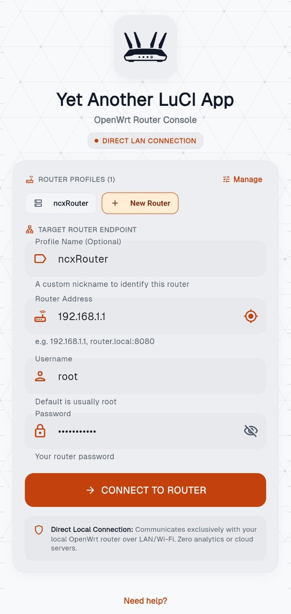
    </td>
    <td width="25%" align="center" valign="top">
      <b>Dashboard (Light)</b><br/><br/>
      
    </td>
    <td width="25%" align="center" valign="top">
      <b>Dashboard (Dark)</b><br/><br/>
      
    </td>
    <td width="25%" align="center" valign="top">
      <b>System Vitals</b><br/><br/>
      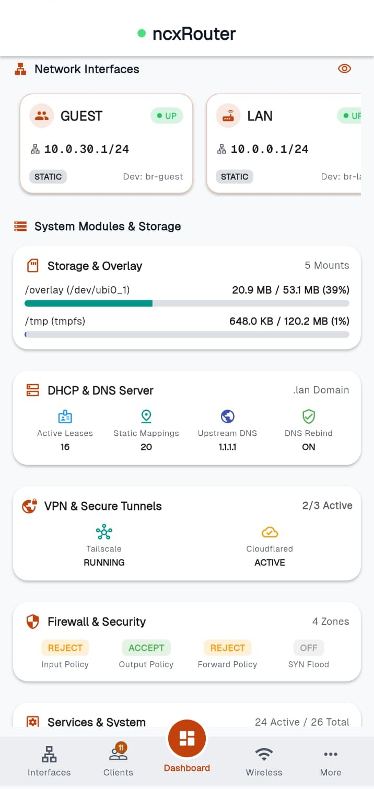
    </td>
  </tr>
  <tr>
    <td width="25%" align="center" valign="top">
      <b>Network Cards</b><br/><br/>
      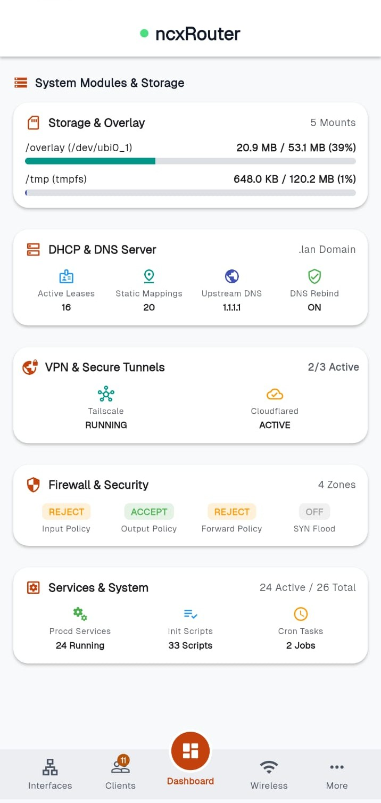
    </td>
    <td width="25%" align="center" valign="top">
      <b>Connected Clients</b><br/><br/>
      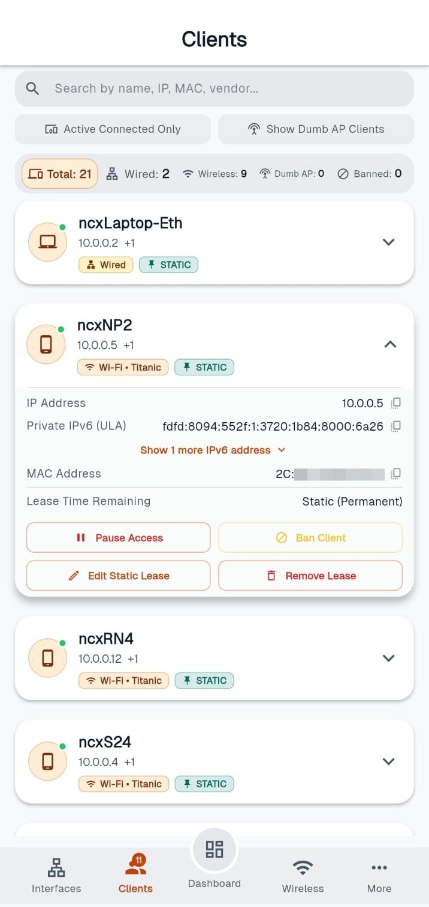
    </td>
    <td width="25%" align="center" valign="top">
      <b>Interfaces</b><br/><br/>
      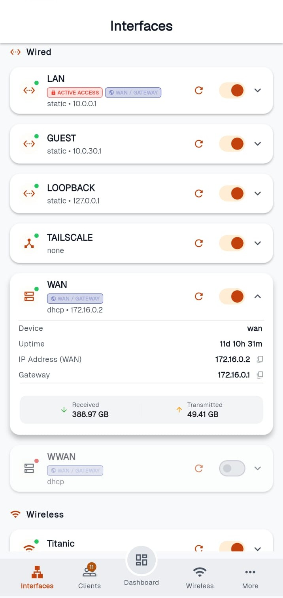
    </td>
    <td width="25%" align="center" valign="top">
      <b>Interface Details</b><br/><br/>
      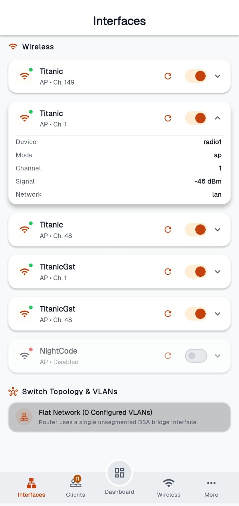
    </td>
  </tr>
  <tr>
    <td width="25%" align="center" valign="top">
      <b>Wireless Radios</b><br/><br/>
      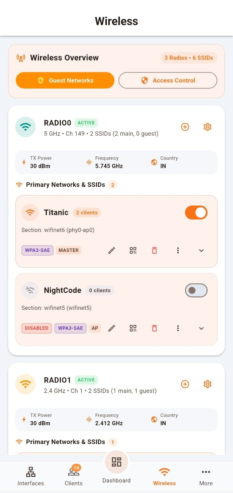
    </td>
    <td width="25%" align="center" valign="top">
      <b>System Info</b><br/><br/>
      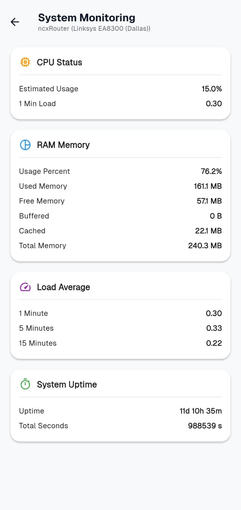
    </td>
    <td width="25%" align="center" valign="top">
      <b>Storage Monitor</b><br/><br/>
      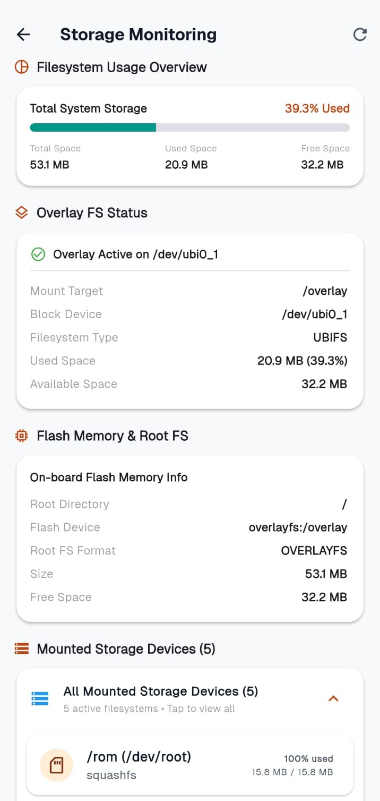
    </td>
    <td width="25%" align="center" valign="top">
      <b>Real-Time Charts</b><br/><br/>
      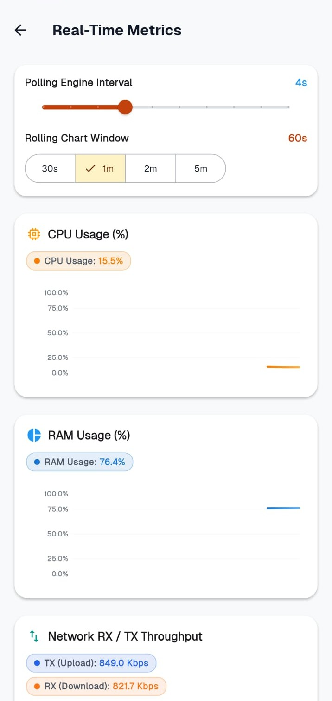
    </td>
  </tr>
  <tr>
    <td width="25%" align="center" valign="top">
      <b>DHCP & DNS</b><br/><br/>
      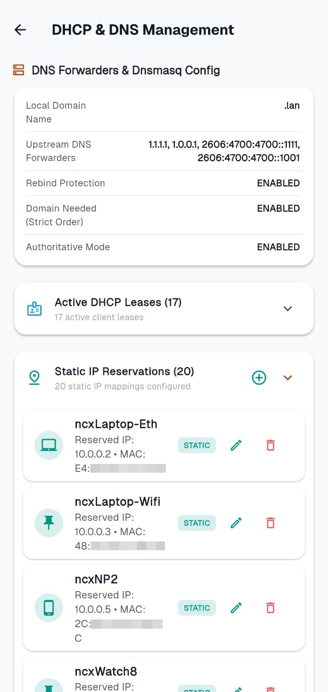
    </td>
    <td width="25%" align="center" valign="top">
      <b>Firewall Rules</b><br/><br/>
      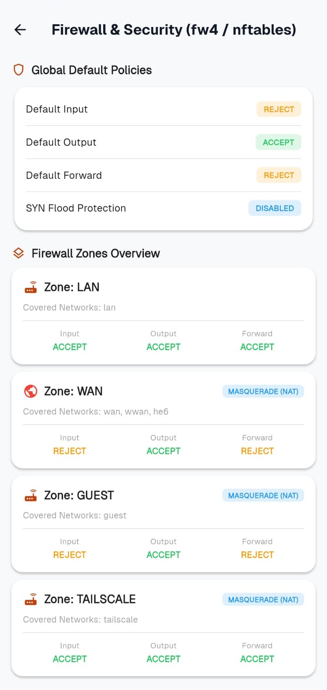
    </td>
    <td width="25%" align="center" valign="top">
      <b>Port Forwarding</b><br/><br/>
      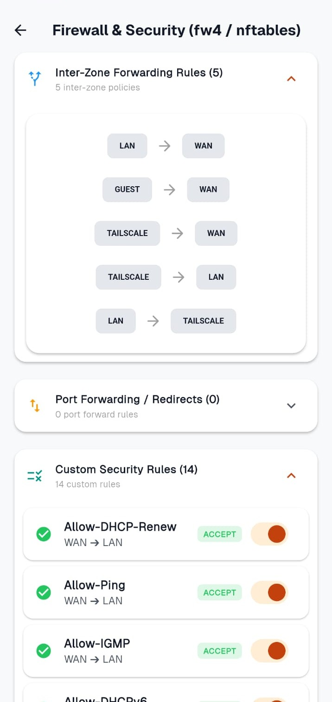
    </td>
    <td width="25%" align="center" valign="top">
      <b>Services & System</b><br/><br/>
      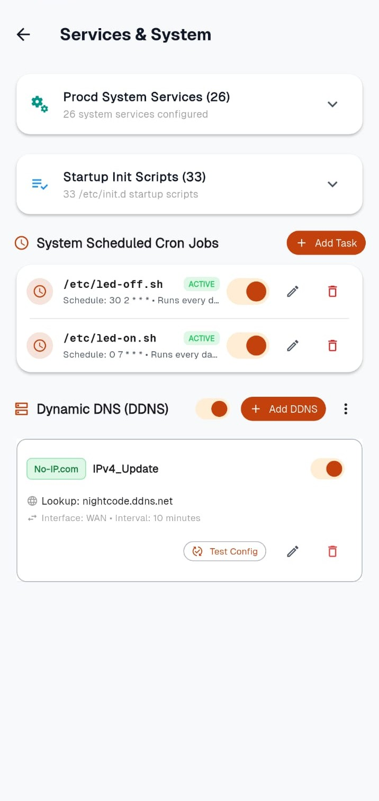
    </td>
  </tr>
  <tr>
    <td width="25%" align="center" valign="top">
      <b>Parental Controls</b><br/><br/>
      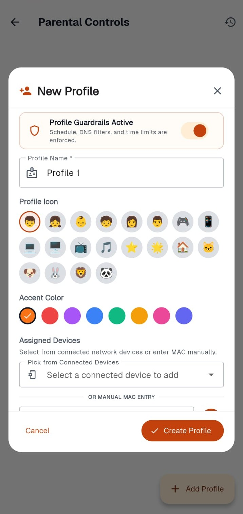
    </td>
    <td width="25%" align="center" valign="top">
      <b>Parental Rules</b><br/><br/>
      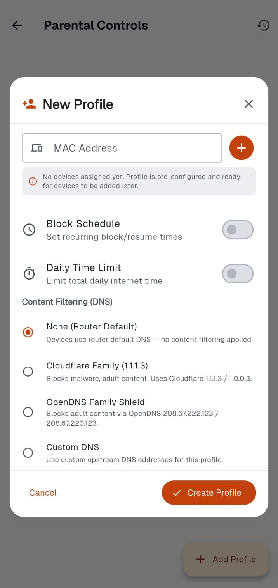
    </td>
    <td width="25%" align="center" valign="top">
      <b>Settings (PlayStore)</b><br/><br/>
      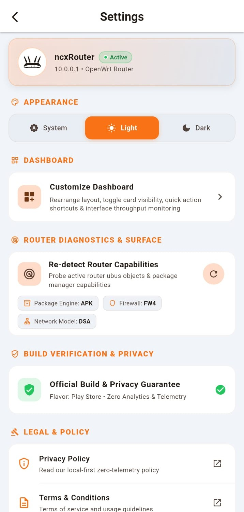
    </td>
    <td width="25%" align="center" valign="top">
      <b>Settings (Community)</b><br/><br/>
      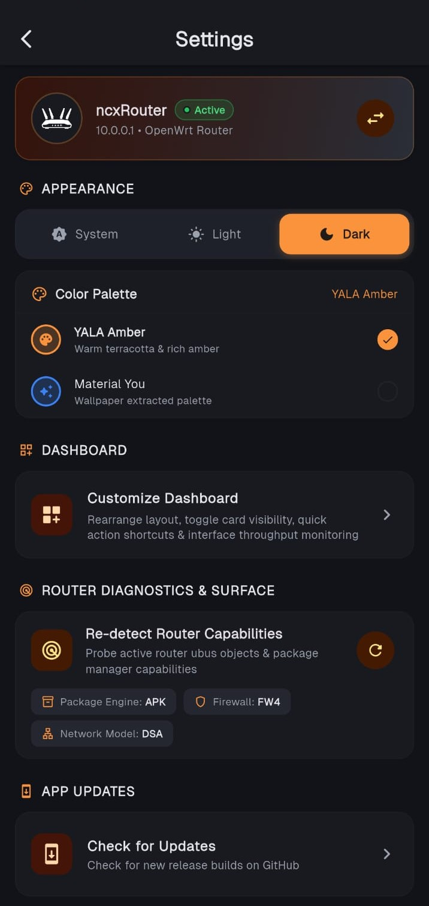
    </td>
  </tr>
  <tr>
    <td colspan="4" align="center" valign="top">
      <b>Tools & Diagnostics (More Menu)</b><br/><br/>
      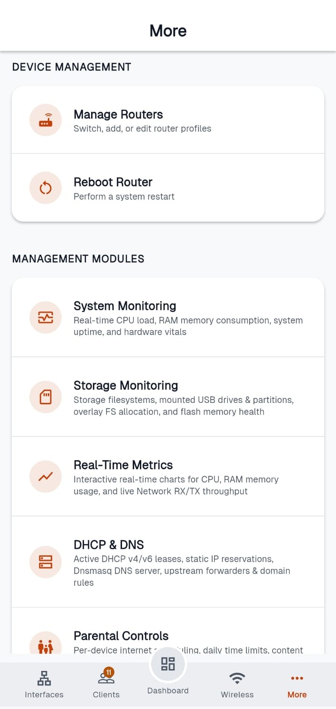
    </td>
  </tr>
  <tr>
    <td colspan="2" width="50%" align="center" valign="top">
      <b>Package Manager (Tablet)</b><br/><br/>
      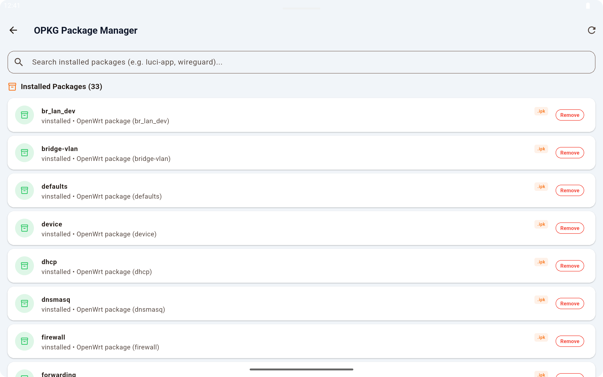
    </td>
    <td colspan="2" width="50%" align="center" valign="top">
      <b>About & App Info (Tablet)</b><br/><br/>
      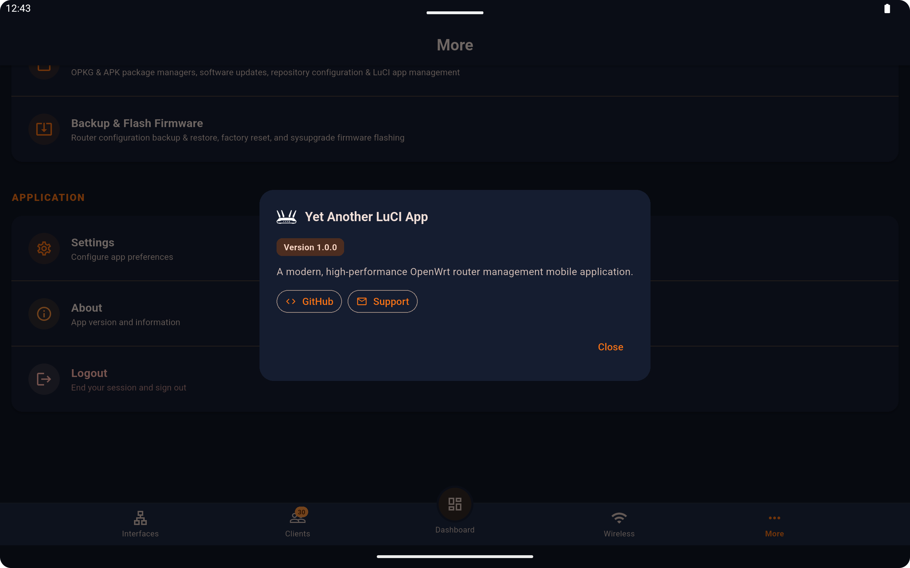
    </td>
  </tr>
</table>

<br>

<div align="center">
  <p><i>Navigate to <a href="assets/screenshots/">assets/screenshots/</a> to view the complete collection of screenshots in the repository.</i></p>
</div>

---

## Repository Structure

```
yala/
├── android/                   # Android native platform code & signing configs
├── assets/                    # Static app assets
│   ├── icons/                 # App launcher icons
│   ├── images/                # Brand graphics & logos
│   ├── mock/                  # Mock diagnostic data for review modes
│   └── screenshots/           # Full app feature screenshots & theme previews
├── fastlane/                  # Google Play Store release metadata & screenshots
├── lib/                       # Main Flutter codebase
│   ├── config/                # Design tokens, themes, app routes, and constants
│   ├── models/                # Data models (Client, Interface, Router, etc.)
│   ├── modules/               # Feature modules (Package Manager, Parental Controls, VPN, Services, Backup, Storage, etc.)
│   ├── screens/               # Core screens (Dashboard, Clients, Interfaces, Login, Settings, More)
│   ├── services/              # API communication layer, JSON-RPC client, secure storage
│   ├── state/                 # State management engine (Riverpod controllers)
│   ├── utils/                 # Security guardrails, HTTP client managers, platform utilities
│   ├── widgets/               # Reusable UI widgets, animated gauges, throughput charts, topology map
│   └── main.dart              # Application entry point
├── scripts/                   # Auxiliary maintenance scripts
├── store-badges/              # Google Play Store promotional badges
├── test/                      # Unit, widget, and integration test suite
├── pubspec.yaml               # Flutter package specification & dependencies
├── CHANGELOG.md               # Version history & sync logs
├── CONTRIBUTING.md            # Guidelines for open-source contributors
├── LICENSE                    # GNU General Public License v3.0 (GPLv3)
├── PRIVACY_POLICY.md          # Privacy policy disclosure
└── README.md                  # Project documentation
```

---

## Building & Running

### Prerequisites

- **Flutter SDK:** 3.32.5+
- **Dart SDK:** 3.8+
- **JDK:** OpenJDK 17 or higher
- **Android Studio / Android SDK:** API level 36

### Quick Local Run

```bash
# 1. Clone repository
git clone https://github.com/nightcodex7/yala.git
cd yala

# 2. Install dependencies
flutter pub get

# 3. Analyze code quality
flutter analyze

# 4. Run test suite
flutter test

# 5. Run application in dev mode
flutter run
```

---

## Router Requirements & Security

(Optional) To enable full communication between **Yet Another LuCI App** and your OpenWrt router, ensure the following RPC modules are installed on your router:

```bash
opkg update
opkg install luci-mod-rpc rpcd-mod-luci rpcd-mod-iwinfo luci-mod-status
/etc/init.d/rpcd restart
```

for OpenWrt 25.12 and newer use the `apk` package manager:

```bash
apk update
apk add rpcd-mod-luci rpcd-mod-iwinfo luci-mod-status
/etc/init.d/rpcd restart
```

### Security Highlights

- **Zero Analytics:** No tracking telemetry, no cloud relays, zero data collection.
- **Local Vault:** Router IP addresses, credentials, and tokens remain isolated on your local device inside native secure storage.
- **Self-Device Guard:** Active IP/MAC auto-detection prevents self-lockout during network access modifications.
- **Atomic Rollbacks:** Staged UCI changes revert automatically if RPC failures occur, preventing broken router state.
- **SSL Support:** Supports HTTPS RPC endpoints and self-signed SSL certificate bypass options for local subnets.

---

<!-- ## Contributing

Contributions, bug reports, and feature suggestions are welcome! Please read [CONTRIBUTING.md](CONTRIBUTING.md) before submitting pull requests.

1. Fork the project.
2. Create your feature branch (`git checkout -b feature/AmazingFeature`).
3. Commit your changes (`git commit -m 'Add some AmazingFeature'`).
4. Push to the branch (`git push origin feature/AmazingFeature`).
5. Open a Pull Request.

--- -->

### Attribution & Licensing

> [!IMPORTANT]
> **yala** is a fork of [`cogwheel0/luci-mobile`](https://github.com/cogwheel0/luci-mobile), originally created and authored by **cogwheel0**.
>
> The combined codebase — including original upstream code and all subsequent modifications — is licensed under the [GNU General Public License v3.0 (GPLv3)](LICENSE).

> [!NOTE]
> **Licensing Correction Note**  
> Previous distributions of this work were incorrectly published under the Apache-2.0 license. This project has been corrected and is properly licensed under GPLv3 as a fork of `cogwheel0/luci-mobile`, effective from this repository's creation.

---

## License

This project is licensed under the **GNU General Public License v3.0 (GPLv3)** - see the [LICENSE](LICENSE) file for details.

Original work Copyright (C) 2025–2026 cogwheel0.  
Modifications Copyright (C) 2026 @nightcodex7.
